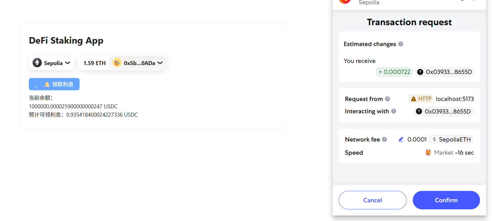

### 一个极简的「计息 USDC」示例，演示了：

1. 如何在 ERC-20 转账过程中自动按区块计息
2. 如何在前端实时估算链下利息并调用合约领取  
   注意：本项目仅用于学习 Solidity 利息模型与 wagmi 前端交互，未做审计，请勿直接用于主网。

### 快速体验：

1. npm install
2. 部署合约，https://remix.ethereum.org/ 编译 MyUSDC.sol
3. 部署成功后把 MyUSDC 地址复制到 src/constants.ts 里的 USDC_ADDRESS
4. 启动前端

